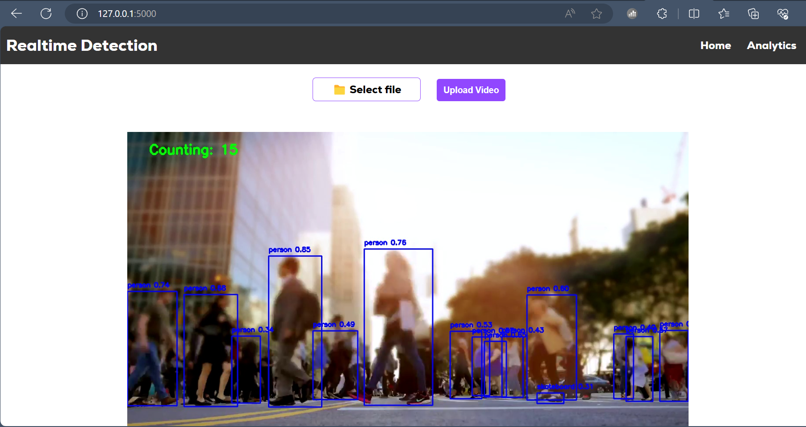

Real-Time Object Detection :

A simple flask web app that performs real-time object detection in video using YOLOv5 ultralytics. 

#### Features
- Video uploading
- Live video feed
- Real-time object detection and bounding boxes
- Confidence score display
- Sqlite database to log detections
- Analytics